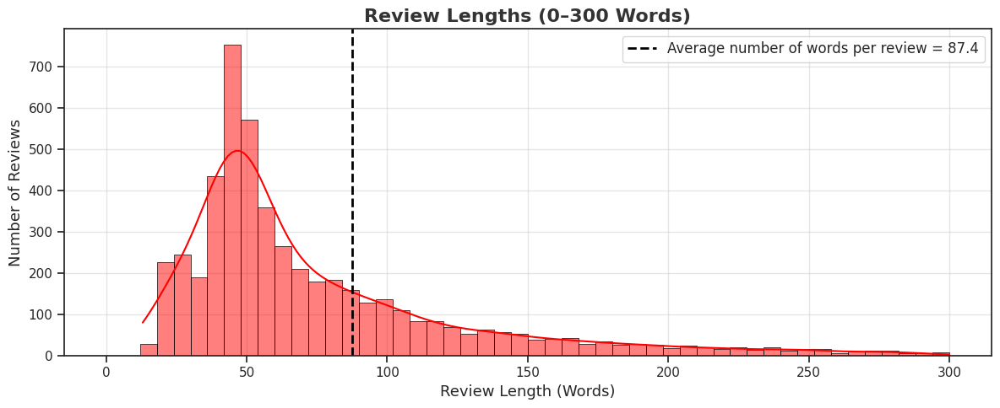
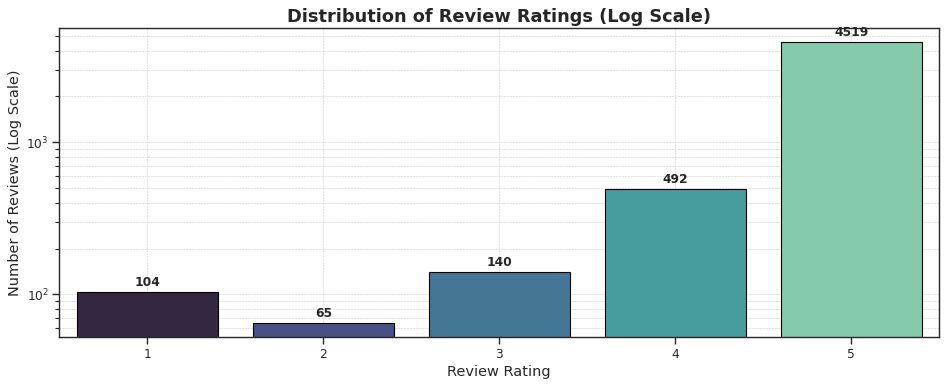
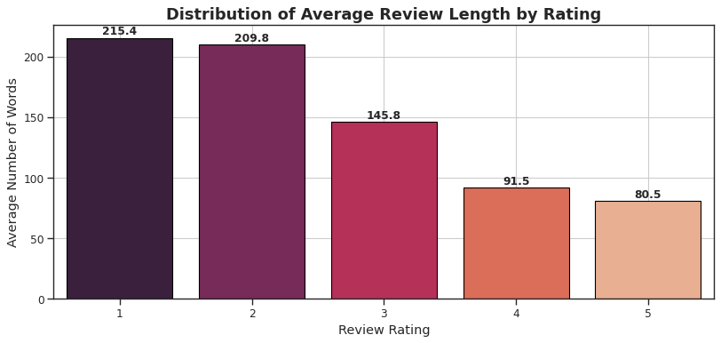
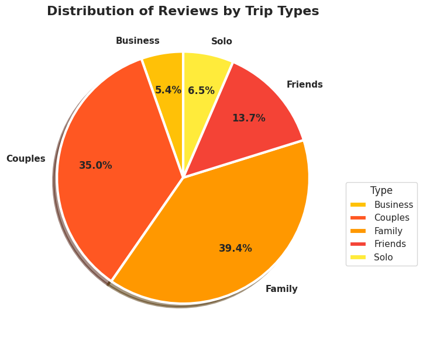
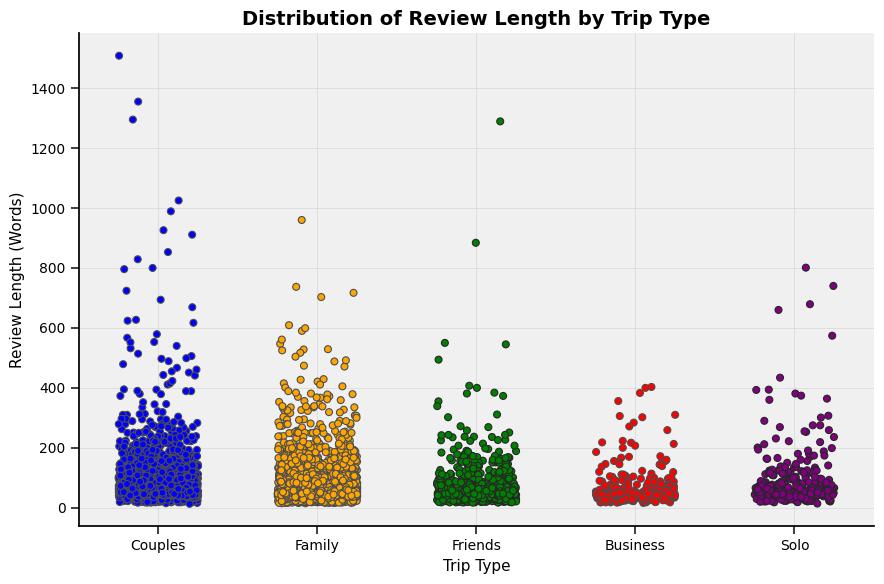

# Executive Summary and Final Recommendations

## 1. Introduction

This project analysed over 5,000 user-generated hotel reviews from TripAdvisor, covering more than 100 Sri Lankan hotels. The goal was to extract customer sentiments and identify areas of excellence or concern across various aspects of the hotel experience, such as service, food, and room quality. By using a combination of automated tools and machine learning methods, the analysis aimed to deliver actionable insights for decision-making, marketing, and operational improvements.                                                      

## 2.0 Overview of the Data
The raw dataset consists of 5,960 raw TripAdvisor reviews from 116 unique Sri Lankan hotels. After data cleaning and preprocessing, the dataset was reduced to 5,320 reviews, with per-hotel review counts ranging from 31 to 60 (mean: 45.86). The raw corpus contained 43,383 unique words, which was reduced to 28,186 unique words.

### 2.1 Review Distribution
Most hotels had between 30 and 60 reviews, with customer feedback averaging 87 words per review. As shown below, most customers left 4- or 5-star ratings, indicating overall satisfaction.

Figure 1: Review Length Histogram

          
Figure 2: Review Rating Distribution

### 2.2 Review Length vs. Sentiment
An interesting pattern emerged: negative reviews were noticeably longer. This suggests that dissatisfied guests invest more effort in detailing their experiences.

Figure 3: Distribution of Average Review Length by Rating

### 2.3 Traveler Demographics
Families and couples contributed the majority of reviews. Their comments were also longer, on average, compared to solo or business travellers.

 
Figure 4: Review Count by Trip Type

Figure 5: Review Length by Trip Type

These findings indicate that dissatisfied guests take more time to explain their experiences, offering valuable information for improvement.                                                           
## 3. Establishing Sentiment Labels
Instead of manually reading thousands of reviews, an automated system was built using three well-known sentiment analysis tools. These tools worked together to assign a final sentiment (positive, negative or neutral) to each review.
- Result: 97% of reviews were labelled positive, 138 reviews were negative, only 9 were neutral.
- Action: Neutral reviews were excluded to avoid class imbalance and focus on clearer, actionable sentiment. Retaining it introduces noise and degrades overall model quality.

This extreme imbalance (about 37 positive reviews for every 1 negative) created challenges in accurately identifying dissatisfaction, which was addressed during modelling.        

## 4. Understanding Customer Sentiment

To understand what drives customer satisfaction or dissatisfaction, four types of text analysis methods were used
- Sparse Vectors: TF-IDF and CountVectorizer
- Dense Vectors: Word2Vec averaged and GloVe averaged embeddings

Both sparse methods generated high-dimensional representations with shapes of (5,311, 10,000), capturing word frequency and importance across the corpus. 
The dense representations used pre-trained Word2Vec and GloVe embeddings averaged across each review, resulting in compact vectors of shape (5,311, 300). These capture semantic similarity.
These methods enabled comparison of different machine learning models, helping to find the most effective approach to detect sentiment from written reviews.                          

## 5. Sentiment Classification – Handling Imbalanced Data

The dataset showed extreme class imbalance, with over 97% of reviews labelled as positive. This posed a significant challenge in building models that could reliably detect the minority negative class.

Two strategies were explored:

- Class Weighting: Applied in Logistic Regression, SVM, and XGBoost to penalize misclassification of the minority class. This preserved the real-world sentiment distribution and improved recall for negative reviews.
- SMOTE Oversampling: Synthetic negative samples were generated to balance the dataset. While this boosted recall, it also introduced instability and inflated false positives in some model combinations.

Among all configurations, SVM with TF-IDF and class weighting achieved the most balanced performance, delivering strong precision and recall without overfitting. XGBoost only performed competitively when paired with dense embeddings (GloVe, Word2Vec), due to its tendency to overfit on sparse patterns.                                                          (130)

## 6. Building Sentiment Detection Models
To compare traditional classifiers against modern deep learning methods, two distinct approaches were implemented.
Approach 1 – Traditional Models (Logistic Regression, SVM, XGBoost) with BERT Embeddings:
Logistic Regression, SVM, and XGBoost were trained on BERT [CLS] pooled embeddings extracted from the pre-trained bert-base-uncased model. 
Among the traditional models, Support Vector Machines (SVM) with weighted classes performed best, balancing the need to catch negative feedback without mislabeling too many positive reviews. However, all traditional classifiers struggled to precisely distinguish negative reviews.
Approach 2 – Modern Deep Learning (BERT Transformer):
In this method, BERT was fine-tuned end-to-end using the Hugging Face Transformers library, allowing it to adapt specifically to the hotel review sentiment classification task.
Results showed, Fine-tuned BERT significantly outperformed all other models, especially in spotting negative reviews accurately.                                                             
Model	Accuracy (%)	F1-Score (Label=1) (%)	Precision (0) (%)	Recall (0) (%)	F1-Score (0) (%)
Logistic Regression + BERT Embeddings	94.71	97.22	31.03	84.84	45.44
SVM + BERT Embeddings	96.55	98.21	40.57	68.20	50.70
XGBoost + BERT Embeddings	93.63	96.64	26.84	83.33	40.58
Fine-Tuned BERT	98.87	99.42	78.57	78.57	78.57
Table 1: Model Performance Overview
Although fine-tuning is computationally expensive, its superior performance especially on underrepresented classes justifies its use in sentiment analysis tasks.                     (145)
7. Exploring Hotel Service Aspects
To go beyond overall sentiment, the analysis explored which specific services (e.g., room, food, staff) drive satisfaction or complaints.
BERTopic was used to group reviews into topics based on similarity. These clusters were treated as hotel “aspects.” While the tool grouped reviews effectively, the clusters did not align well with human-defined service categories. For example, one cluster might mix comments about food and staff, making it difficult to extract clear signals.
Despite this limitation, sentiment classification models were trained within each cluster. Positive feedback was generally well-detected, but negative feedback remained difficult to capture due to the small number of negative samples in each aspect group.
This method still offers actionable insights (e.g., identifying which service areas consistently receive positive feedback) even if classification of dissatisfaction remains challenging.                                                                                                                 (128)
8. Key Limitations
Several challenges impacted the outcomes:
•	Extreme Class Imbalance: Too few negative reviews limited the ability to build accurate models for dissatisfaction.
•	No Manual Review of Sentiments: All labels were generated by ensemble methods, which may misinterpret mixed or subtle opinions.
•	Poor Aspect Alignment: BERTopic clustering didn’t match well with real-world hotel review categories like Room, Food, Service, Location.
•	Sparse Aspect-Level Data: Many clusters had very few negative reviews, reducing model reliability.
•	Resource-Intensive Deep Learning: Fine-tuning BERT is effective but costly, needing GPUs or cloud infrastructure.                                                               (85)
9. Final Recommendations
Based on the findings, the following strategic recommendations are proposed:
1. Focus Future Data Collection on Negative Reviews
The current review data is heavily skewed toward positive feedback. Actively gather more negative reviews (e.g., by analysing feedback from low-rated hotels or other platforms.) This will help in developing more balanced and accurate sentiment detection systems.
2. Improve Aspect Detection Strategy
BERTopic clustering does not clearly separate hotel services (Room, Food, Staff etc.). Consider using guided topic modelling that incorporates known keywords or categories to better align clusters with operational departments. This will enable clearer insights and more actionable findings.
3. Enhance Aspect Sentiment Models via Multi-Task Learning
Rather than training separate models for each hotel aspect, future work should use multi-task learning where a single model learns all aspects together. This approach shares data and knowledge across aspects, improving performance even with limited data.
4. Optimize Models for Deployment
Fine-tuned BERT offers the best accuracy but is too resource-heavy for many real-world applications. For practical use:
•	Explore model compression techniques (like distillation).
•	Use smaller, efficient models (e.g., DistilBERT) where speed is critical.
5. Add Explainability to Sentiment Predictions
To build trust and encourage adoption, incorporate visual tools like attention maps or keyword highlights can show what influenced the prediction, helping hotel managers understand and act on insights.
6. Implement an Active Learning Workflow
Instead of trying to label everything upfront, use active learning, where the BERTopic asks for human input only when it’s uncertain. This allows gradually improvement of label quality and model performance over time.
